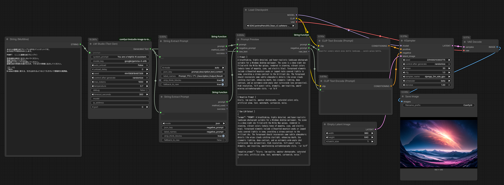

# ComfyUI-String-Function

ComfyUI 用の文字列操作カスタムノード集です。  
LLM の出力からプロンプトを抽出する **String Extract Prompt** をはじめ、検索・分割・置換・正規表現など、テキスト処理に役立つノードを収録しています。

---

## インストール

### ComfyUI Manager（推奨）

ComfyUI Manager の「Install via Git URL」から以下の URL を入力してください。

```
https://github.com/TakkunRed/ComfyUI-String-Function
```

### 手動インストール

`ComfyUI/custom_nodes/` フォルダに本リポジトリをクローンして ComfyUI を再起動してください。

```bash
cd ComfyUI/custom_nodes
git clone https://github.com/TakkunRed/ComfyUI-String-Function
```

---

## ノード一覧

| ノード名 | 概要 |
|---|---|
| [String Extract Prompt](#string-extract-prompt) | LLM出力からプロンプトだけを抽出 ★ |
| [Prompt Preview](#prompt-preview) | Prompt / Negative Prompt / Raw テキストを確認・中継 |
| [String Find](#string-find) | 文字列の位置を検索 |
| [String Split](#string-split) | 区切り文字の前後に分割 |
| [String Left / Mid / Right](#string-left--mid--right) | Excel系の文字列切り出し |
| [String Default](#string-default) | 空のときのフォールバック |
| [String Replace](#string-replace) | 文字列の置換 |
| [String Trim](#string-trim) | 前後の空白・指定文字を除去 |
| [String Case](#string-case) | 大文字・小文字の変換 |
| [String Regex Match](#string-regex-match) | 正規表現でマッチ・抽出 |

---

## String Extract Prompt

LLM（LM Studio 等）の出力テキストから、画像生成プロンプトの文字列だけを抽出するノードです。  
モデルや設定によって出力形式が変わっても自動的に吸収し、KSampler や CLIPTextEncode に直接接続できます。

### ワークフロー例



[📥 ワークフローをダウンロード](workflow/String%20Extract%20Prompt.json)

上記ワークフローの構成は以下の通りです。

```
[PrimitiveStringMultiline]          [CheckpointLoaderSimple]
 （プロンプト指示文）                        │ MODEL / CLIP / VAE
        │                                    │
[Expo LM Studio Text Generation] ─────────────────────────────→
        │                                               │
        ├──→ [String Extract Prompt]               [KSampler]
        │     mode: auto / json_key: prompt             │
        │            │ prompt                      [VAEDecode]
        │            │                                  │
        ├──→ [String Extract Prompt]            [SaveImage]
        │     mode: json / json_key: negative_prompt
        │     fallback_to_raw: False
        │            │ prompt（= negative_prompt）
        │            │
        └──→ [Prompt Preview] ─── prompt ──→ [CLIPTextEncode positive]
              （raw_text直結）  ─── negative_prompt ──→ [CLIPTextEncode negative]
```

**ポイント：**
- `prompt` 用と `negative_prompt` 用で **String Extract Prompt を2つ使い分けます**
- `negative_prompt` 用は `mode=json`、`json_key=negative_prompt`、`fallback_to_raw=False` に設定することで、negative_prompt が存在しないモデル出力の場合に空文字が返ります
- `Prompt Preview` で prompt / negative_prompt / raw_text を一括確認しながら後続ノードへ中継できます

### 対応している出力パターン

| パターン | 入力例 | 抽出結果 |
|---|---|---|
| JSON | `{"prompt": "masterpiece, 1girl"}` | `masterpiece, 1girl` |
| コードブロック | ` ```masterpiece, 1girl``` ` | `masterpiece, 1girl` |
| ラベル付き | `Prompt: masterpiece, 1girl` | `masterpiece, 1girl` |
| カンマ区切りタグ列 | カンマが最も多い段落 | その段落 |
| 前置き文 | `Here is the prompt: masterpiece, 1girl` | `masterpiece, 1girl` |
| think ブロック | `<think>...</think> masterpiece, 1girl` | `masterpiece, 1girl` |
| gpt-oss-20b形式 | `<\|channel\|>final<\|message\|>PROMPT: ...` | プロンプト本文 |

### 入力

| パラメータ | 型 | デフォルト | 説明 |
|---|---|---|---|
| `text` | STRING | — | LLM の出力テキスト |
| `mode` | SELECT | `auto` | 抽出モード（下表参照） |
| `json_key` | STRING | `prompt,description,text,content` | json モード時に探すキー名。カンマ区切りで優先順に複数指定可 |
| `label_names` | STRING | `Prompt,プロンプト,Description,Output,Result` | after_label モードで認識するラベル名。カンマ区切り |
| `strip_think_blocks` | BOOLEAN | `True` | `<think>...</think>` ブロックを事前に除去する（Qwen等） |
| `fallback_to_raw` | BOOLEAN | `True` | auto モードで全手法失敗時: True=クリーン済みテキスト全体を返す / False=空を返す |

### 出力

| 出力名 | 型 | 説明 |
|---|---|---|
| `prompt` | STRING | 抽出されたプロンプト |
| `method_used` | STRING | 実際に使用された抽出手法名 |
| `success` | BOOLEAN | 抽出に成功したか（False = fallback または未抽出） |

### モード一覧

`auto` モードでは `code_block` → `json` → `after_label` → `most_commas` の順に試み、最初に成功したものを返します。  
全て失敗した場合は `fallback_to_raw` の設定に従います。

| mode | 動作 | auto で使用 |
|---|---|:---:|
| `auto` | 以下を順番に試す（推奨） | — |
| `code_block` | ` ``` ``` ` または `` ` ` `` の中身を抽出 | ✓ |
| `json` | JSON オブジェクトから `json_key` のキーの値を抽出 | ✓ |
| `after_label` | `Prompt:` 等のラベル後テキストを抽出 | ✓ |
| `most_commas` | カンマが最も多い段落を返す（SD タグ列の特徴を利用） | ✓ |
| `strip_preamble` | "Here is..." 等の前置き文を除去して残りを返す | — |
| `first_line` | 最初の空でない行を返す | — |
| `raw` | クリーン処理（think除去・特殊トークン除去）のみ行いそのまま返す | — |

> **Note:** `strip_preamble` / `first_line` / `raw` は必ず何か返るため auto では使用しません。  
> 個別モードとして明示的に指定した場合に使います。

### LM Studio の設定

LM Studio の Structured Output（JSON Schema）を使うと出力が安定します。  
以下のスキーマを LM Studio の Structured Output 欄に貼り付けてください。

```json
{
  "type": "object",
  "properties": {
    "prompt": {
      "type": "string",
      "description": "Main prompt (comma-separated tags)"
    },
    "negative_prompt": {
      "type": "string",
      "description": "Negative prompt"
    }
  },
  "required": ["prompt", "negative_prompt"],
  "additionalProperties": false
}
```

ノード側の設定：

| ノード | mode | json_key | fallback_to_raw |
|---|---|---|---|
| prompt 用 | `json` | `prompt` | `True` |
| negative_prompt 用 | `json` | `negative_prompt` | `False` |

> **Note:** `gpt-oss-20b` は独自のチャンネルフォーマット（`<|channel|>final<|message|>`）を使うため、  
> Structured Output を使わず `mode=auto` のままで正常に動作します。

---

## Prompt Preview

Prompt / Negative Prompt / Raw LLM テキストを1つのテキストエリアに整形して表示し、後続ノードへ中継するノードです。

### 入力（すべてオプション）

| パラメータ | 型 | 説明 |
|---|---|---|
| `prompt` | STRING | 抽出済みプロンプト |
| `negative_prompt` | STRING | 抽出済みネガティブプロンプト |
| `raw_text` | STRING | LLM の生出力 |

### 出力

入力と同じ `prompt` / `negative_prompt` / `raw_text` をそのままスルーします。  
ノード上のテキストエリアで3つの内容を一括確認できます。

---

## String Find

文字列内で特定の文字列が何文字目にあるかを返します（1始まり、見つからない場合は 0）。

| パラメータ | 型 | デフォルト | 説明 |
|---|---|---|---|
| `text` | STRING | — | 検索対象テキスト |
| `search` | STRING | — | 検索する文字列 |
| `start_pos` | INT | `1` | 検索を開始する位置（1始まり） |
| `occurrence` | INT | `1` | 何番目の出現を検索するか |

**出力:** `position` (INT) — 見つかった位置（1始まり）。見つからない場合は `0`

---

## String Split

区切り文字の前後で文字列を分割します。

| パラメータ | 型 | デフォルト | 説明 |
|---|---|---|---|
| `text` | STRING | — | 分割対象テキスト |
| `delimiter` | STRING | — | 区切り文字 |
| `occurrence` | INT | `1` | 何番目の区切り文字で分割するか |
| `use_last` | BOOLEAN | `False` | True にすると最後の区切り文字で分割 |

**出力:** `before` (STRING) / `after` (STRING)

---

## String Left / Mid / Right

Excel の LEFT・MID・RIGHT 関数に相当する文字列切り出しノードです。

| ノード | パラメータ | 説明 |
|---|---|---|
| String Left | `num_chars` | 左から取り出す文字数 |
| String Mid | `start_pos`, `num_chars` | 指定位置から指定文字数を取り出す |
| String Right | `num_chars` | 右から取り出す文字数 |

---

## String Default

テキストが空のとき、代わりの文字列を返します。

| パラメータ | 型 | デフォルト | 説明 |
|---|---|---|---|
| `text` | STRING | — | 入力テキスト |
| `default_value` | STRING | — | 空のときに返す文字列 |
| `trim_before_check` | BOOLEAN | `False` | チェック前に前後の空白を除去する |

**出力:** `result` (STRING) / `was_empty` (BOOLEAN)

---

## String Replace

文字列を検索して置換します。

| パラメータ | 型 | デフォルト | 説明 |
|---|---|---|---|
| `text` | STRING | — | 対象テキスト |
| `old` | STRING | — | 置換前の文字列 |
| `new` | STRING | — | 置換後の文字列 |
| `count` | INT | `-1` | 置換する最大回数（`-1` で全て置換） |
| `case_sensitive` | BOOLEAN | `True` | False にすると大文字小文字を無視 |

**出力:** `result` (STRING) / `replace_count` (INT)

---

## String Trim

文字列の前後から空白または指定文字を除去します。

| パラメータ | 型 | デフォルト | 説明 |
|---|---|---|---|
| `text` | STRING | — | 対象テキスト |
| `mode` | SELECT | `both` | `both` / `left` / `right` |
| `chars` | STRING | — | 除去する文字。空白のままにすると空白文字を除去 |

---

## String Case

文字列の大文字・小文字を変換します。

| mode | 動作 | 例 |
|---|---|---|
| `upper` | 全て大文字 | `HELLO WORLD` |
| `lower` | 全て小文字 | `hello world` |
| `title` | 各単語の先頭を大文字 | `Hello World` |
| `capitalize` | 文頭だけ大文字 | `Hello world` |
| `swapcase` | 大小を反転 | `hELLO wORLD` |

---

## String Regex Match

正規表現でテキストを検索・抽出します。

| パラメータ | 型 | デフォルト | 説明 |
|---|---|---|---|
| `text` | STRING | — | 対象テキスト |
| `pattern` | STRING | — | 正規表現パターン |
| `mode` | SELECT | `search` | `search` / `match` / `fullmatch` / `findall` |
| `group` | INT | `0` | 取得するグループ番号（0=マッチ全体） |
| `ignore_case` | BOOLEAN | `False` | 大文字小文字を無視する |
| `multiline` | BOOLEAN | `False` | `^` `$` を各行の先頭・末尾にマッチ |
| `join_str` | STRING | `, ` | `findall` モードで複数結果を結合する区切り文字 |

**出力:** `result` (STRING) / `matched` (BOOLEAN) / `match_count` (INT)

### 使用例

| やりたいこと | pattern | mode | group |
|---|---|---|---|
| 数字を抽出 | `\d+` | `search` | `0` |
| 全ての数字を取得 | `\d+` | `findall` | — |
| 日付から月を取得 | `(\d{4})-(\d{2})-(\d{2})` | `search` | `2` |

---

## ライセンス

MIT License
