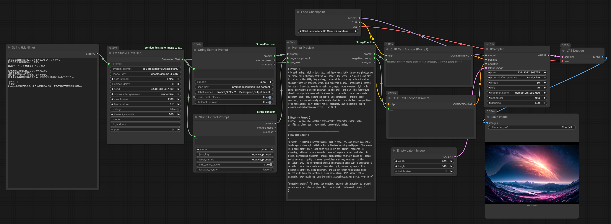

# ComfyUI-String-Function

ComfyUI 用の文字列操作・ファイル読み込みカスタムノード集です。  
テキストファイルの読み込み、LLM の出力からのプロンプト抽出、検索・分割・置換・正規表現など、テキスト処理に役立つノードを収録しています。

---

## インストール

### ComfyUI Manager（推奨）

ComfyUI Manager の「Install via Git URL」から以下の URL を入力してください。

```
https://github.com/TakkunRed/ComfyUI-String-Function
```

### 手動インストール

`ComfyUI/custom_nodes/` フォルダに本リポジトリをクローンして ComfyUI を再起動してください。

```bash
cd ComfyUI/custom_nodes
git clone https://github.com/TakkunRed/ComfyUI-String-Function
```

---

## ノード一覧

| ノード名 | 概要 |
|---|---|
| [File Read](#file-read) | テキストファイル全体を読み込む |
| [File Read Line](#file-read-line) | テキストファイルを1行ずつ読み込む（実行のたびに次の行へ） |
| [Folder File Read](#folder-file-read) | フォルダ内のファイルを1つずつ読み込む（実行のたびに次のファイルへ） |
| [LM Studio Prompt Generator](#lm-studio-prompt-generator) | テーマ → LM Studio 生成 → prompt / negative_prompt 抽出を1ノードで ★ |
| [String Extract Prompt](#string-extract-prompt) | LLM出力からプロンプトだけを抽出 ★ |
| [Prompt Preview](#prompt-preview) | Prompt / Negative Prompt / Raw テキストを確認・中継 |
| [String Find](#string-find) | 文字列の位置を検索 |
| [String Split](#string-split) | 区切り文字の前後に分割 |
| [String Left / Mid / Right](#string-left--mid--right) | Excel系の文字列切り出し |
| [String Default](#string-default) | 空のときのフォールバック |
| [String Replace](#string-replace) | 文字列の置換 |
| [String Trim](#string-trim) | 前後の空白・指定文字を除去 |
| [String Case](#string-case) | 大文字・小文字の変換 |
| [String Regex Match](#string-regex-match) | 正規表現でマッチ・抽出 |

---

## File Read

テキストファイル全体を読み込み、文字列として出力するノードです。

### 入力

| パラメータ | 型 | デフォルト | 説明 |
|---|---|---|---|
| `file_path` | STRING | — | 読み込むファイルのパス |
| `encoding` | SELECT | `auto` | 文字コード（下表参照） |
| `strip_newline_end` | BOOLEAN | `True` | ファイル末尾の改行を除去する |

### 出力

| 出力名 | 型 | 説明 |
|---|---|---|
| `text` | STRING | ファイル全体の内容 |
| `line_count` | INT | 行数 |
| `success` | BOOLEAN | 読み込み成功したか（ファイルが存在しない場合は `False`） |

### encoding の選択肢

| 値 | 動作 |
|---|---|
| `auto` | `utf-8-sig` → `utf-8` → `cp932` の順に自動判別（推奨） |
| `utf-8` | UTF-8（BOM なし） |
| `utf-8-sig` | UTF-8（BOM あり、Windows メモ帳保存ファイル等） |
| `cp932` | Shift-JIS（Windows 日本語環境） |

> **Note:** パスの前後にダブルクォート（`"C:\path\to\file.txt"`）が付いていても自動で除去します。  
> ノード上の「📄 ファイルを参照...」ボタンをクリックするとファイル選択ダイアログが開きます。

---

## File Read Line

テキストファイルを1行ずつ読み込むノードです。  
実行のたびに自動で次の行へ進み、末尾に達すると先頭に戻ってループします。

### 入力

| パラメータ | 型 | デフォルト | 説明 |
|---|---|---|---|
| `file_path` | STRING | — | 読み込むファイルのパス |
| `mode` | SELECT | `sequential` | 読み込み順序（下表参照） |
| `reset` | BOOLEAN | `False` | `True` を受けた実行でカウンタを先頭にリセット |
| `encoding` | SELECT | `auto` | 文字コード（File Read と同じ） |
| `skip_empty_lines` | BOOLEAN | `False` | `True` にすると空行をスキップしてカウント |

### 出力

| 出力名 | 型 | 説明 |
|---|---|---|
| `line_text` | STRING | 現在の行の内容（末尾改行は除去済み） |
| `line_index` | INT | 現在読んでいるファイル内の行番号（1始まり） |
| `line_count` | INT | 総行数（`skip_empty_lines=True` のときは空行除外後の数） |
| `is_last` | BOOLEAN | 今回の行が末尾だったか（次回は先頭に戻る） |

### mode の選択肢

| mode | 動作 |
|---|---|
| `sequential` | 1行目 → 2行目 → … → 末尾 → 1行目 → … と順番に進む |
| `shuffle` | 全行をシャッフルして重複なしで消費。全件読み終えると再シャッフルして繰り返す |

> **Note:** カウンタはメモリ上に保持されます。ComfyUI を再起動するとリセットされます。  
> 同じファイルを読む複数のノードはそれぞれ独立したカウンタを持ちます。

---

## Folder File Read

指定フォルダ内のファイルを1つずつ読み込むノードです。  
実行のたびに自動で次のファイルへ進み、末尾に達すると先頭に戻ってループします。

### 入力

| パラメータ | 型 | デフォルト | 説明 |
|---|---|---|---|
| `folder_path` | STRING | — | フォルダのパス |
| `mode` | SELECT | `sequential` | 読み込み順序（下表参照） |
| `reset` | BOOLEAN | `False` | `True` を受けた実行でカウンタを先頭にリセット |
| `extension_filter` | STRING | `.txt` | 対象拡張子（カンマ区切り例: `.txt,.md`）。空白で全ファイル |
| `encoding` | SELECT | `auto` | 文字コード（File Read と同じ） |
| `sort_order` | SELECT | `name_asc` | `sequential` モード時のファイル順序（下表参照） |

### 出力

| 出力名 | 型 | 説明 |
|---|---|---|
| `text` | STRING | ファイル全体の内容 |
| `file_name` | STRING | ファイル名（パスなし・拡張子あり） |
| `file_path_out` | STRING | ファイルのフルパス |
| `file_index` | INT | 現在のファイルがリスト内の何番目か（1始まり） |
| `file_count` | INT | フィルタ後の総ファイル数 |
| `is_last` | BOOLEAN | 今回のファイルが末尾だったか（次回は先頭に戻る） |

### mode の選択肢

| mode | 動作 |
|---|---|
| `sequential` | `sort_order` の順に 1→2→…→末尾→1→2→… と進む |
| `shuffle` | 全ファイルをシャッフルして重複なしで消費。全件終了後に再シャッフルして繰り返す |

### sort_order の選択肢（sequential モード時）

| 値 | 動作 |
|---|---|
| `name_asc` | ファイル名の昇順（A → Z） |
| `name_desc` | ファイル名の降順（Z → A） |
| `modified_asc` | 更新日時の古い順 |
| `modified_desc` | 更新日時の新しい順 |

> **Note:** カウンタはメモリ上に保持されます。ComfyUI を再起動するとリセットされます。  
> ノード上の「📂 フォルダを参照...」ボタンをクリックするとフォルダ選択ダイアログが開きます。

---

## LM Studio Prompt Generator

「指示文 → LM Studio Text Gen → String Extract Prompt ×2」の構成を1ノードにまとめたものです。
LM Studio の **Structured Output（JSON Schema）** を自動で付与するため、出力形式の崩れによる抽出ミスが起きません。
（Prompt Preview は別ノードのまま。`prompt` / `negative_prompt` / `raw_text` をそのまま接続できます）

### セットアップ

`.env.example` を `.env` にコピーし、LM Studio のURLを設定します（未設定なら `http://localhost:1234`）。

```
LMSTUDIO_BASE_URL=http://localhost:1234
```

**リモートの LM Studio を使う場合**

```
LMSTUDIO_BASE_URL=http://192.168.1.10:1234
```

- LM Studio 側で Developer → Server Settings の **「ローカルネットワークで提供 (Serve on Local Network)」** を有効にし、ファイアウォールでポートを開けてください
- `.env` は実行のたびに読み込むので、変更後に ComfyUI の再起動は不要です
- `model_key` を空にすると、リモート側で **ロード済みのモデル**を自動検出して使用します

### 入力

| パラメータ | デフォルト | 説明 |
|---|---|---|
| `theme` | — | ユーザーメッセージ（画像のテーマ） |
| `system_prompt` | 画像プロンプト作成の指示文 | LLMへの指示。**出力形式の指定は不要**（自動付与） |
| `model_key` | 空 | LM Studio のモデルキー。空ならロード済みモデル |
| `structured_output` | `True` | JSON Schema で出力を強制。`False` なら `PROMPT:` / `NEGATIVE:` 形式で出力させて抽出 |
| `generate_negative` | `True` | negative_prompt も生成 |
| `seed` | `-1` | `-1` は実行ごとにランダム |
| `max_tokens` / `temperature` | `4096` / `0.7` | 生成パラメータ |
| `auto_unload` / `unload_delay` | `False` / `0` | 生成後のアンロード。delay>0 は TTL（秒）、0 は即時（即時は `lmstudio` SDK が必要） |
| `timeout_seconds` | `300` | 応答待ちの上限 |
| `strip_thinking` | `True` | `raw_text` から思考部を除去 |
| `debug` | `False` | リクエスト/レスポンスをコンソール出力 |

### 出力

`prompt` / `negative_prompt` / `raw_text` / `method_used` / `success`

> 接続失敗・タイムアウト時はエラーとしてワークフローを停止します（空プロンプトで生成が進まないように）。

---

## String Extract Prompt

LLM（LM Studio 等）の出力テキストから、画像生成プロンプトの文字列だけを抽出するノードです。  
モデルや設定によって出力形式が変わっても自動的に吸収し、KSampler や CLIPTextEncode に直接接続できます。

### ワークフロー例



[📥 ワークフローをダウンロード](workflow/String%20Extract%20Prompt.json)

上記ワークフローの構成は以下の通りです。

```
[PrimitiveStringMultiline]          [CheckpointLoaderSimple]
 （プロンプト指示文）                        │ MODEL / CLIP / VAE
        │                                    │
[Expo LM Studio Text Generation] ─────────────────────────────→
        │                                               │
        ├──→ [String Extract Prompt]               [KSampler]
        │     mode: auto / json_key: prompt             │
        │            │ prompt                      [VAEDecode]
        │            │                                  │
        ├──→ [String Extract Prompt]            [SaveImage]
        │     mode: json / json_key: negative_prompt
        │     fallback_to_raw: False
        │            │ prompt（= negative_prompt）
        │            │
        └──→ [Prompt Preview] ─── prompt ──→ [CLIPTextEncode positive]
              （raw_text直結）  ─── negative_prompt ──→ [CLIPTextEncode negative]
```

**ポイント：**
- `prompt` 用と `negative_prompt` 用で **String Extract Prompt を2つ使い分けます**
- `negative_prompt` 用は `mode=json`、`json_key=negative_prompt`、`fallback_to_raw=False` に設定することで、negative_prompt が存在しないモデル出力の場合に空文字が返ります
- `Prompt Preview` で prompt / negative_prompt / raw_text を一括確認しながら後続ノードへ中継できます

### 対応している出力パターン

| パターン | 入力例 | 抽出結果 |
|---|---|---|
| JSON | `{"prompt": "masterpiece, 1girl"}` | `masterpiece, 1girl` |
| コードブロック | ` ```masterpiece, 1girl``` ` | `masterpiece, 1girl` |
| ラベル付き | `Prompt: masterpiece, 1girl` | `masterpiece, 1girl` |
| カンマ区切りタグ列 | カンマが最も多い段落 | その段落 |
| 前置き文 | `Here is the prompt: masterpiece, 1girl` | `masterpiece, 1girl` |
| think ブロック | `<think>...</think> masterpiece, 1girl` | `masterpiece, 1girl` |
| gpt-oss-20b形式 | `<\|channel\|>final<\|message\|>PROMPT: ...` | プロンプト本文 |

### 入力

| パラメータ | 型 | デフォルト | 説明 |
|---|---|---|---|
| `text` | STRING | — | LLM の出力テキスト |
| `mode` | SELECT | `auto` | 抽出モード（下表参照） |
| `json_key` | STRING | `prompt,positive_prompt,positive,description,text,content` | json モード時に探すキー名。カンマ区切りで優先順。大文字小文字・空白/`_`/`-` の違いは無視し、入れ子JSONも探索 |
| `label_names` | STRING | `Prompt,プロンプト,Description,Output,Result` | after_label モードで認識するラベル名。カンマ区切り |
| `strip_think_blocks` | BOOLEAN | `True` | `<think>` 等の思考ブロックを事前に除去する（Qwen3 / DeepSeek-R1 等。開始タグ無しの `</think>`、閉じ忘れにも対応） |
| `fallback_to_raw` | BOOLEAN | `True` | auto モードで確信を持てないとき: True=前置き除去済みテキストを返す（success=False） / False=空を返す |

### 出力

| 出力名 | 型 | 説明 |
|---|---|---|
| `prompt` | STRING | 抽出されたプロンプト |
| `method_used` | STRING | 実際に使用された抽出手法名 |
| `success` | BOOLEAN | 抽出に成功したか（False = fallback または未抽出） |

### モード一覧

`auto` モードでは `json` → `code_block` → `after_label` → 前置き/後書き除去（`strip_preamble` / `most_commas` / `plain`）の順に試み、最初に成功したものを返します。  
複数段落で本文を特定できないときのみ `fallback_to_raw` の設定に従います（`method_used` = `raw_fallback`、`success` = False）。

| mode | 動作 | auto で使用 |
|---|---|:---:|
| `auto` | 以下を順番に試す（推奨） | — |
| `json` | JSON（コードブロック内・地の文中・入れ子・途中で切れた出力も可）から `json_key` の値を抽出 | ✓ |
| `code_block` | ` ``` ``` ` の中身を抽出（json/yaml 等の言語指定ブロックは除外） | ✓ |
| `after_label` | `Prompt:` / `**Prompt:**` / `### Positive Prompt` 等のラベル後テキストを抽出 | ✓ |
| `strip_preamble` | 前置き（"Here is..." / 「以下がプロンプトです」）・後書き・引用符・Negative 段落を除去 | ✓（最終段） |
| `most_commas` | カンマが最も多い段落を返す（SD タグ列の特徴を利用） | ✓（最終段） |
| `first_line` | 前置きを除いた最初の空でない行を返す | — |
| `raw` | クリーン処理のみ行いそのまま返す | — |

### 対応しているモデル出力

| モデル系統 | 吸収する形式 |
|---|---|
| Qwen3 / DeepSeek-R1 | `<think>…</think>`、開始タグ無し `</think>`、閉じ忘れ `<think>` |
| gpt-oss | `<\|channel\|>analysis…` を除去し `final` チャンネルのみ採用 |
| Llama 3 / Qwen(ChatML) / Gemma / Mistral | `<\|start_header_id\|>assistant…`、`<\|im_start\|>assistant`、`<start_of_turn>model`、`[INST]…[/INST]`、`</s>` 等 |
| 会話調モデル全般 | 前置き・後書き、`**Prompt:**` 等のマークダウン装飾、Negative prompt 併記 |

> **Note:** 説明文的な出力（"The image shows a cat..."）はプロンプト本文そのものとして扱い、削除しません。

### LM Studio の設定

LM Studio の Structured Output（JSON Schema）を使うと出力が安定します。  
以下のスキーマを LM Studio の Structured Output 欄に貼り付けてください。

```json
{
  "type": "object",
  "properties": {
    "prompt": {
      "type": "string",
      "description": "Main prompt (comma-separated tags)"
    },
    "negative_prompt": {
      "type": "string",
      "description": "Negative prompt"
    }
  },
  "required": ["prompt", "negative_prompt"],
  "additionalProperties": false
}
```

ノード側の設定：

| ノード | mode | json_key | fallback_to_raw |
|---|---|---|---|
| prompt 用 | `json` | `prompt` | `True` |
| negative_prompt 用 | `json` | `negative_prompt` | `False` |

> **Note:** `gpt-oss-20b` は独自のチャンネルフォーマット（`<|channel|>final<|message|>`）を使うため、  
> Structured Output を使わず `mode=auto` のままで正常に動作します。

---

## Prompt Preview

Prompt / Negative Prompt / Raw LLM テキストを1つのテキストエリアに整形して表示し、後続ノードへ中継するノードです。

### 入力（すべてオプション）

| パラメータ | 型 | 説明 |
|---|---|---|
| `prompt` | STRING | 抽出済みプロンプト |
| `negative_prompt` | STRING | 抽出済みネガティブプロンプト |
| `raw_text` | STRING | LLM の生出力 |

### 出力

入力と同じ `prompt` / `negative_prompt` / `raw_text` をそのままスルーします。  
ノード上のテキストエリアで3つの内容を一括確認できます。

---

## String Find

文字列内で特定の文字列が何文字目にあるかを返します（1始まり、見つからない場合は 0）。

| パラメータ | 型 | デフォルト | 説明 |
|---|---|---|---|
| `text` | STRING | — | 検索対象テキスト |
| `search` | STRING | — | 検索する文字列 |
| `start_pos` | INT | `1` | 検索を開始する位置（1始まり） |
| `occurrence` | INT | `1` | 何番目の出現を検索するか |

**出力:** `position` (INT) — 見つかった位置（1始まり）。見つからない場合は `0`

---

## String Split

区切り文字の前後で文字列を分割します。

| パラメータ | 型 | デフォルト | 説明 |
|---|---|---|---|
| `text` | STRING | — | 分割対象テキスト |
| `delimiter` | STRING | — | 区切り文字 |
| `occurrence` | INT | `1` | 何番目の区切り文字で分割するか |
| `use_last` | BOOLEAN | `False` | True にすると最後の区切り文字で分割 |

**出力:** `before` (STRING) / `after` (STRING)

---

## String Left / Mid / Right

Excel の LEFT・MID・RIGHT 関数に相当する文字列切り出しノードです。

| ノード | パラメータ | 説明 |
|---|---|---|
| String Left | `num_chars` | 左から取り出す文字数 |
| String Mid | `start_pos`, `num_chars` | 指定位置から指定文字数を取り出す |
| String Right | `num_chars` | 右から取り出す文字数 |

---

## String Default

テキストが空のとき、代わりの文字列を返します。

| パラメータ | 型 | デフォルト | 説明 |
|---|---|---|---|
| `text` | STRING | — | 入力テキスト |
| `default_value` | STRING | — | 空のときに返す文字列 |
| `trim_before_check` | BOOLEAN | `False` | チェック前に前後の空白を除去する |

**出力:** `result` (STRING) / `was_empty` (BOOLEAN)

---

## String Replace

文字列を検索して置換します。

| パラメータ | 型 | デフォルト | 説明 |
|---|---|---|---|
| `text` | STRING | — | 対象テキスト |
| `old` | STRING | — | 置換前の文字列 |
| `new` | STRING | — | 置換後の文字列 |
| `count` | INT | `-1` | 置換する最大回数（`-1` で全て置換） |
| `case_sensitive` | BOOLEAN | `True` | False にすると大文字小文字を無視 |

**出力:** `result` (STRING) / `replace_count` (INT)

---

## String Trim

文字列の前後から空白または指定文字を除去します。

| パラメータ | 型 | デフォルト | 説明 |
|---|---|---|---|
| `text` | STRING | — | 対象テキスト |
| `mode` | SELECT | `both` | `both` / `left` / `right` |
| `chars` | STRING | — | 除去する文字。空白のままにすると空白文字を除去 |

---

## String Case

文字列の大文字・小文字を変換します。

| mode | 動作 | 例 |
|---|---|---|
| `upper` | 全て大文字 | `HELLO WORLD` |
| `lower` | 全て小文字 | `hello world` |
| `title` | 各単語の先頭を大文字 | `Hello World` |
| `capitalize` | 文頭だけ大文字 | `Hello world` |
| `swapcase` | 大小を反転 | `hELLO wORLD` |

---

## String Regex Match

正規表現でテキストを検索・抽出します。

| パラメータ | 型 | デフォルト | 説明 |
|---|---|---|---|
| `text` | STRING | — | 対象テキスト |
| `pattern` | STRING | — | 正規表現パターン |
| `mode` | SELECT | `search` | `search` / `match` / `fullmatch` / `findall` |
| `group` | INT | `0` | 取得するグループ番号（0=マッチ全体） |
| `ignore_case` | BOOLEAN | `False` | 大文字小文字を無視する |
| `multiline` | BOOLEAN | `False` | `^` `$` を各行の先頭・末尾にマッチ |
| `join_str` | STRING | `, ` | `findall` モードで複数結果を結合する区切り文字 |

**出力:** `result` (STRING) / `matched` (BOOLEAN) / `match_count` (INT)

### 使用例

| やりたいこと | pattern | mode | group |
|---|---|---|---|
| 数字を抽出 | `\d+` | `search` | `0` |
| 全ての数字を取得 | `\d+` | `findall` | — |
| 日付から月を取得 | `(\d{4})-(\d{2})-(\d{2})` | `search` | `2` |

---

## ライセンス

MIT License
